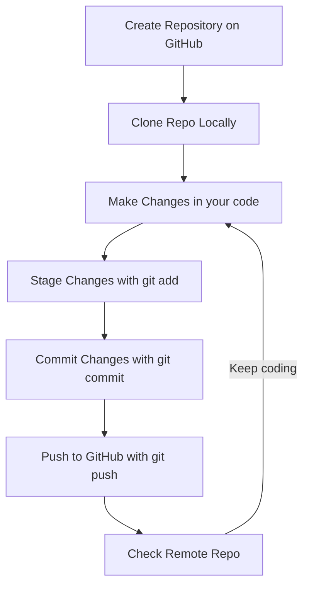

# Basic Git Commands You Need to Know

Understanding Git can be easier if you think of it like sending packages (your files) to a secure vault in another country — that vault is GitHub. Just like mailing a package, there are steps you must follow to prepare, organize, and send your files safely. Git is the tool that helps you manage each part of this process.

## `git init`

This command initializes a new Git repository in your project folder. Use it when you're starting a new project and want to track its changes with Git.

```bash
git init
```

### 📦 Analogy

Think of this as getting some brand-new empty boxes where you’ll place the items (files) you plan to ship.


---

## `git add`

This command tells Git which files you want to include in the next snapshot (commit).

To add all files:

```bash
git add .
```

To add a specific file:

```bash
git add [specific_file.txt]
```

### 📦 Analogy

This is like placing items into your box. For example:

```bash
git add mug.txt
```

You're putting a mug inside the box.


---

## `git commit`

This command saves the changes you've added, along with a message describing what you did.

```bash
git commit -m "A message explaining the commit"
```

### 📦 Analogy

This is like sealing your box with tape and labeling it. For example:

```bash
git commit -m "This is a mug, it is very fragile"
```

You're sealing the box and writing on it: "This is a mug, it is very fragile."


---

## `git status`

This command shows the current state of your project: which files have changed, which are staged for commit, and more.

```bash
git status
```

### 📦 Analogy

This is like checking what's inside the box. You can see if it’s open, what’s been added, and what still needs sealing. If the box is not sealed yet, you can just see what is inside, but if it is sealed this command grants you some cool X Ray vision to see what is inside.


---

## `git log`

This command shows a history of all your commits — the messages you wrote, and when you made the changes.

```bash
git log
```

### 📦 Analogy

This is like flipping through your shipping logbook. It lists all the boxes you've sent, when you sent them, and what labels (messages) you wrote on each one.


---

## `git push`

This command sends your committed changes to a remote repository like GitHub.

```bash
git push origin main
```

### 📦 Analogy

This is like handing your sealed and labeled box to the shipping company. You're finally sending it off to the secure vault (GitHub) in another country. Until you push, the box is still sitting at your place — prepared, but not delivered.


---

## `git pull`

This command updates your local repository with the latest changes from the remote.

```bash
git pull origin main
```

### 🔄 Analogy

This is like checking your mailbox for any new packages before sending yours. Someone else may have added more things to the shared vault (GitHub), and it's polite — and safe — to make sure you're not about to overwrite or miss anything.


---

To see these commands in VS Code, check the [VS Code Git](commands_vs_code.en.md).

## Aditional considerations

Even though the box analogy works perfectly, you need to know that the `git init` command rarely gets used. Normally, the workflow for git is the following:

<center>

</center>

If we clone a remote repository, we can skip the `git init` step.