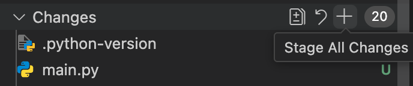
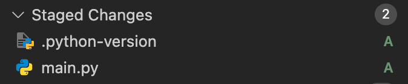
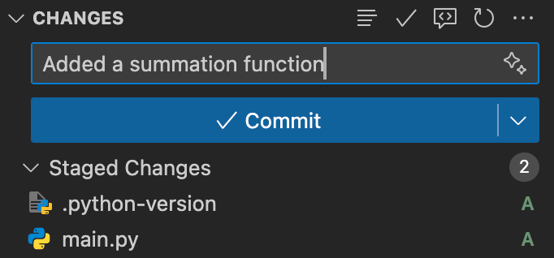

# Basic Git Commands You Need to Know in Visual Studio Code

In Visual Studio Code, there is a Built-In feature to manage your git repository. IN the left side of your VS Code window, you will see this symbol:

Click on it to use the graphical interface.

## `git add`

This command tells Git which files you want to include in the next snapshot (commit).

To add all files, click the `+` symbol in the changes section:

To add a specific file, click the `+` symbol in the file you want to add:

You will see your added files in the `Staged Changes` section:

---

## `git commit`

This command saves the changes you've added, along with a message describing what you did.

You can set your message in the `message` box. When you are ready, just press the `commit` button:

---

## `git status`

This command is not available through VS Code. Yu can see the state of each file with the UI, seeing if the files are `Staged`. If you see no files in the git section, then you have made no changes to those files.

---

## `git push`

This command sends your committed changes to a remote repository like GitHub.

To run this, just press the `Sync Changes` button:

To see these commands in terminal, check the [Git Commands](commands.en.md).