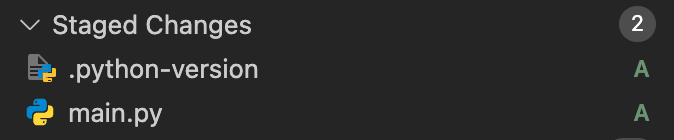

# Comandos básicos de Git que necesitas saber en Visual Studio Code

En Visual Studio Code, hay una función incorporada para gestionar tu repositorio Git. En el lado izquierdo de tu ventana de VS Code, verás este símbolo:

Haz clic en él para usar la interfaz gráfica.

## `git add`

Este comando le dice a Git qué archivos quieres incluir en la próxima instantánea (commit).

Para agregar todos los archivos, haz clic en el símbolo `+` en la sección de cambios:

Para agregar un archivo específico, haz clic en el símbolo `+` en el archivo que deseas agregar:

Verás tus archivos agregados en la sección `Staged Changes` (Cambios preparados):

---

## `git commit`

Este comando guarda los cambios que has agregado, junto con un mensaje que describe lo que hiciste.

Puedes establecer tu mensaje en el cuadro de `message` (mensaje). Cuando estés listo, simplemente presiona el botón `commit`:

---

## `git status`

Este comando no está disponible a través de VS Code. Puedes ver el estado de cada archivo con la interfaz de usuario, viendo si los archivos están `Staged` (Preparados). Si no ves ningún archivo en la sección de Git, entonces no has realizado cambios en esos archivos.

---

## `git push`

Este comando envía tus cambios confirmados a un repositorio remoto como GitHub.

Para ejecutar esto, simplemente presiona el botón `Sync Changes` (Sincronizar cambios):

Para ver estos comandos en la terminal, consulta los [Comandos de Git](commands.es.md).