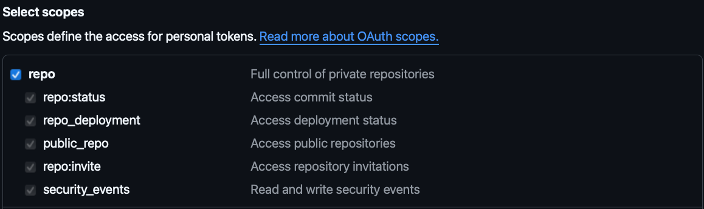
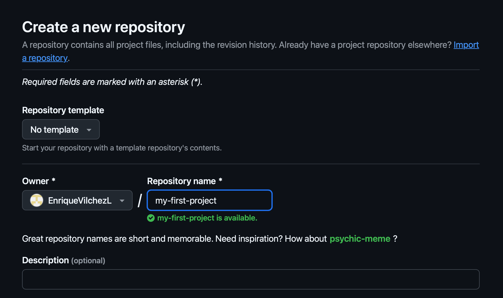

# 🛠️ How to Install Git and Use GitHub

Hey there! 👋 Let’s get Git set up on your computer and connect it to GitHub. It’s easier than you think — just follow the steps below!

---

## 💻 Installing Git on Your Computer

Pick your operating system below to see the right instructions 👇

=== "🪟 Windows"

    1. Go to [https://git-scm.com/download/win](https://git-scm.com/download/win)
    2. Download the file and run it.
    3. Click “Next” through the setup — the default settings are perfect.
    4. Done. 🎉

=== "🍏 Mac"

    1. Open the **Terminal** app (search for "Terminal").
    2. Type this and press Enter:  
       `git --version`
    3. If it says Git is not installed, type:  
       `xcode-select --install`
    4. Follow the instructions that pop up. ✅

=== "🐧 Linux (Ubuntu)"

    1. Open **Terminal**.
    2. Type the following commands one at a time and press Enter:  

       ```
       sudo apt-get update
       sudo apt-get install git
       ```
    3. All done! Git is installed and ready. 💪

---

## ✍️ Initial Git Configuration

### Tell Git who you are

After installing Git, open **Git Bash** (on Windows) or **Terminal** (on Mac or Linux). Then type the following 👇

```bash
git config --global user.name "Your Name"
git config --global user.email "your.email@example.com"
```

This tells Git how to sign your projects — like leaving your digital signature.

---

## 🔐 What happens the first time you use `git clone`?

When you try to copy (or “clone”) a project from GitHub for the first time, Git needs to confirm your identity. This is called **authentication**, and it works differently depending on your computer:

---

=== "🪟 Windows"

    1. Open a **Terminal** and type the following to clone your repository:
    ```bash
    git clone https://github.com/your-username/your-repository.git
    ```

    2. A **browser window** will automatically open.
    3. Sign in to GitHub with your username and password — just like you normally would on the website.
    4. Done! 🎉 Git will remember you and won’t ask for your password every time.

    > ✅ This works thanks to a tool called **Git Credential Manager (GCM)**, which is included with Git for Windows. It stores your credentials securely on your computer.

=== "🍏 Mac"

    1. Open your browser and go to:  
    [https://github.com/settings/tokens](https://github.com/settings/tokens)

    2. Click on **"Generate new token"**.
    3. When creating the token:

        - Add a note so you remember what it's for (e.g., "Repository access").
        - Choose a duration (e.g., 90 days). When it expires, you’ll need to create a new one and repeat these steps. If you don’t want it to expire, you can set it to "no expiration". ⚠️ Not recommended for security reasons, but it’s your choice.
        - Check the `repo` box to give it access to your repositories.

        

    4. Click **"Generate token"** at the bottom.  
    🔐 Copy the token that appears (save it somewhere safe — you won’t be able to see it again later!).

    5. Then open **Terminal** and type:
        ```bash
        git config --global credential.helper store
        ```
    This tells Git to save your credentials so you don’t have to type your token every time you interact with GitHub. Now try cloning your repository:
        ```bash
        git clone https://github.com/your-username/your-repository.git
        ```

    6. Git will ask for:

        - Your **GitHub username**
        - Your **token** (that long code you copied earlier). When you paste the token, you will see nothing in the terminal, and that is completely normal. It was pasted, but the terminal did not show it because it is treated like a password.

    7. Done! You can now use `git push`, `git clone`, etc. without issues.

    > ⚠️ This stores your token in a plain text file on your computer. It's fine if it's your personal machine — but don't do this on public or shared computers.

=== "🐧 Linux"

    1. Open your browser and go to:  
    [https://github.com/settings/tokens](https://github.com/settings/tokens)

    2. Click on **"Generate new token"**.
    3. When creating the token:

        - Add a note so you remember what it's for (e.g., "Repository access").
        - Choose a duration (e.g., 90 days). When it expires, you’ll need to create a new one and repeat these steps. If you don’t want it to expire, you can set it to "no expiration". ⚠️ Not recommended for security reasons, but it’s your choice.
        - Check the `repo` box to give it access to your repositories.

        

    4. Click **"Generate token"** at the bottom.  
    🔐 Copy the token that appears (save it somewhere safe — you won’t be able to see it again later!).

    5. Then open **Terminal** and type:
        ```bash
        git config --global credential.helper store
        ```
    This tells Git to save your credentials so you don’t have to type your token every time you interact with GitHub. Now try cloning your repository:
        ```bash
        git clone https://github.com/your-username/your-repository.git
        ```

    6. Git will ask for:

        - Your **GitHub username**
        - Your **token** (that long code you copied earlier). When you paste the token, you will see nothing in the terminal, and that is completely normal. It was pasted, but the terminal did not show it because it is treated like a password.

    7. Done! You can now use `git push`, `git clone`, etc. without issues.

    > ⚠️ This stores your token in a plain text file on your computer. It's fine if it's your personal machine — but don't do this on public or shared computers.

---

## 🌐 What is GitHub?

GitHub is a free website where you can:

- 🗃️ Store your projects online
- 👯 Collaborate with others
- 📣 Show your work to the world!

Git is the tool we use for local version control, and GitHub helps us share that version control with more people across different machines.

## 🚀 How to Use GitHub

- Go to [https://github.com](https://github.com) and **sign up for a free account**.


- In the top-right corner, click the **+** icon and choose **New repository**.


- Give your project a name (like `my-first-project`) and click **Create repository**.



Git has many other options, for now the ones that could be important are:

    - Public repository: The repository is visible to anyone. Use this for projects you want to share with many people.
    - Private repository: The repository is visible to you and the people yoi invite only. Use this for private projects, where you want to protect your code.

- After it's created, copy the web address (also called the **URL**) that looks something like: `https://github.com/your-username/your-repo-name.git`.


- Now open the **Terminal** and type this command to copy the project to your computer:

```bash
git clone [https://github.com/your-username/your-repo-name.git]
```

- Press Enter and Git will download the project folder to your computer. 🎉