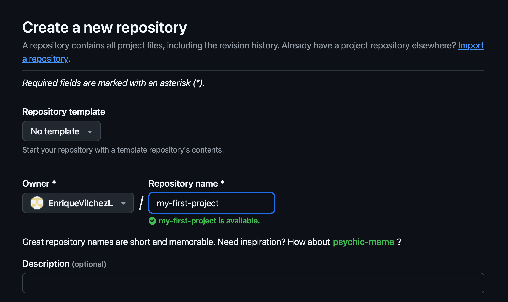

# 🛠️ Cómo instalar Git y usar GitHub

¡Hola! 👋 Vamos a configurar Git en tu computadora y conectarlo a GitHub. Es más fácil de lo que crees, ¡solo sigue los pasos a continuación!

---

## 💻 Instalando Git en tu computadora

Elige tu sistema operativo a continuación para ver las instrucciones correctas 👇

=== "🪟 Windows"

    1. Ve a [https://git-scm.com/download/win](https://git-scm.com/download/win)
    2. Descarga el archivo y ejecútalo.
    3. Haz clic en "Siguiente" durante la instalación; la configuración predeterminada es perfecta.
    4. ¡Listo! 🎉

=== "🍏 Mac"

    1. Abre la aplicación **Terminal** (busca "Terminal").
    2. Escribe esto y presiona Enter:
       `git --version`
    3. Si dice que Git no está instalado, escribe:
       `xcode-select --install`
    4. Sigue las instrucciones que aparezcan. ✅

=== "🐧 Linux (Ubuntu)"

    1. Abre **Terminal**.
    2. Escribe los siguientes comandos uno por uno y presiona Enter:

       ```bash
       sudo apt-get update
       sudo apt-get install git
       ```
    3. ¡Todo listo! Git está instalado y preparado. 💪

---

## ✍️ Configura Git con tu nombre

Una vez que Git esté instalado, abre Git Bash o Terminal y dile a Git quién eres:

```bash
git config --global user.name "Tu Nombre"
git config --global user.email "tu.email@example.com"
```

## 🌐 ¿Qué es GitHub?

GitHub es un sitio web gratuito donde puedes:

- 🗃️ **Almacenar tus proyectos en línea**: Imagina que es como un gran disco duro en la nube para todo tu código.
- 👯 **Colaborar con otros**: Trabaja en equipo en un mismo proyecto sin sobrescribir el trabajo de los demás.
- 📣 **Mostrar tu trabajo al mundo**: Comparte tus creaciones con reclutadores, amigos o la comunidad.

---

## 🚀 Cómo usar GitHub

- Ve a [https://github.com](https://github.com) y **regístrate para obtener una cuenta gratuita**.


- En la esquina superior derecha, haz clic en el icono **+** y elige **New repository** (Nuevo repositorio).


- Dale un nombre a tu proyecto (como `mi-primer-proyecto`) y haz clic en **Create repository** (Crear repositorio).



Git tiene muchas otras opciones, por ahora las que podrían ser importantes son:

    - **Repositorio público**: El repositorio es visible para cualquiera. Úsalo para proyectos que quieras compartir con mucha gente.
    - **Repositorio privado**: El repositorio es visible solo para ti y las personas que invites. Úsalo para proyectos privados, donde quieras proteger tu código.

- Después de crearlo, copia la dirección web (también llamada **URL**) que se parece a: `https://github.com/tu-nombre-de-usuario/nombre-de-tu-repositorio.git`.


- Ahora abre la **Terminal** y escribe este comando para copiar el proyecto a tu computadora:

```bash
git clone [[https://github.com/tu-nombre-de-usuario/nombre-de-tu-repositorio.git](https://github.com/tu-nombre-de-usuario/nombre-de-tu-repositorio.git)]
```

- Presiona Enter y Git descargará la carpeta del proyecto a tu computadora. 🎉